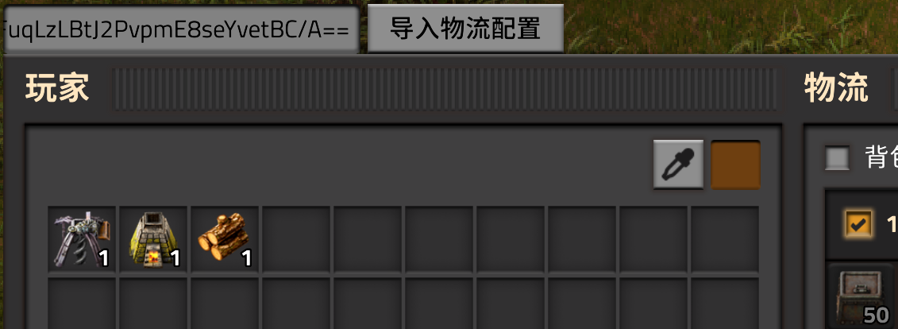

# 物流预设保存模组 (Logistic Preset Save)

一个用于异星工厂(Factorio)的模组，允许玩家保存和加载物流配置预设。

## 功能特性

- ✅ **保存物流配置**：将当前物流请求配置保存为文本格式
- ✅ **加载物流配置**：从文本快速恢复物流配置
- ✅ **多语言支持**：支持中文和英文界面
- ✅ **简洁界面**：直观的GUI界面，易于操作

## 安装方法

1. 下载模组文件
2. 将模组文件夹放入Factorio的mods目录
3. 启动游戏并启用模组

## 使用方法

### 保存物流配置

1. 打开物流界面（快捷键L）
2. 模组会自动显示物流配置文本（如果修改需要重新打开更新）
3. 复制文本内容保存到文件

### 加载物流配置

1. 打开物流界面
2. 将保存的配置文本粘贴到文本框中
3. 点击"导入物流配置"按钮
4. 物流配置将立即生效

## 界面说明

- **配置文本框**：显示或输入物流配置文本
- **导入按钮**：点击后加载配置到当前物流系统

## 错误处理

模组会自动检测并提示以下错误：

- ❌ **没有物流科技**：玩家尚未研究物流科技时无法使用
- ❌ **配置文件损坏**：配置文本格式错误或损坏

## 文件结构

```
logipreset-save/
├── control.lua          # 主要控制脚本
├── data.lua             # 数据定义
├── info.json            # 模组信息
├── locale/              # 本地化文件
│   ├── en/logipreset-save.cfg
│   └── zh-CN/logipreset-save.cfg
├── settings.lua         # 设置文件
├── util.lua             # 工具函数
├── factorio-util.lua    # Factorio工具函数
└── README.md            # 说明文档
```

## 技术细节

### 核心函数

- `hasLogisticsEnabled(player)` - 检查物流功能是否开启
- `get_player_logistic_presets_text(player)` - 获取物流配置文本
- `set_player_logistic_presets(player, presets_text)` - 设置物流配置

### 事件处理

- `on_gui_opened` - GUI打开事件，创建/更新界面
- `on_gui_click` - GUI点击事件，处理导入操作

## 兼容性

- **Factorio版本**：支持最新稳定版
- **依赖模组**：无硬性依赖
- **冲突模组**：暂无已知冲突

## 开发信息

### 本地化支持

模组支持以下语言：

- **英文** (en)
- **简体中文** (zh-CN)

### 代码结构

代码采用模块化设计，包含清晰的注释和错误处理机制。

## 更新日志

详见 [changelog.txt](changelog.txt)

## 许可证

[在此添加许可证信息]

## 贡献

欢迎提交问题和改进建议！

---

*最后更新：2024年*